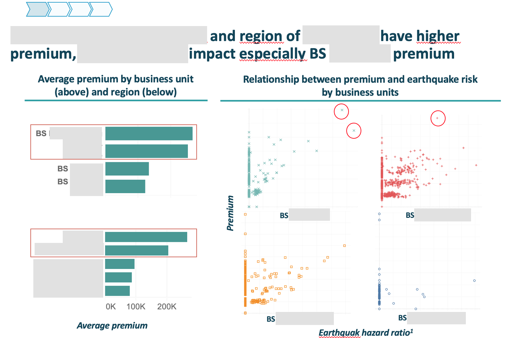
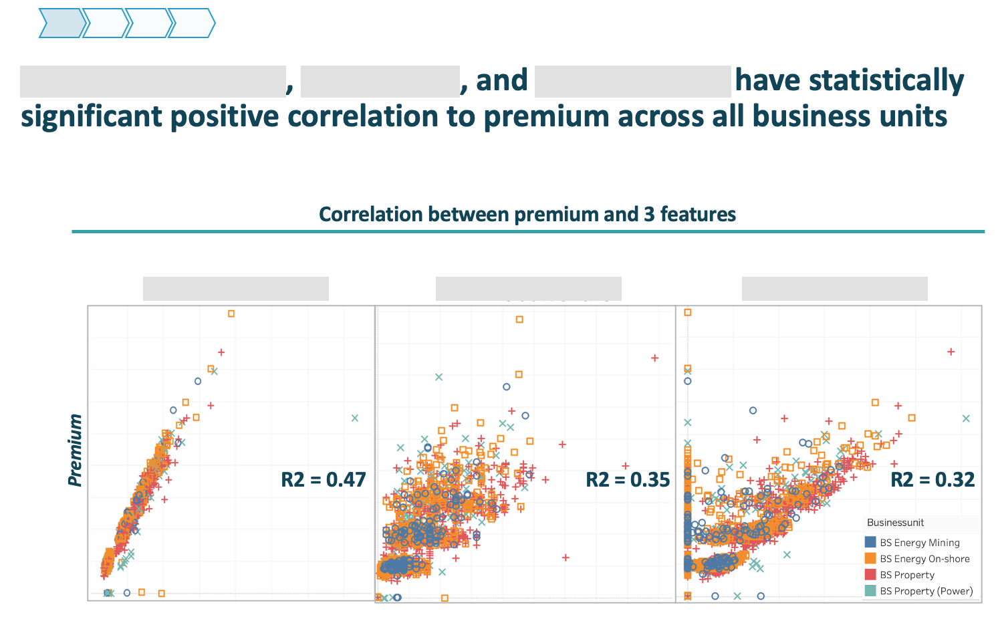
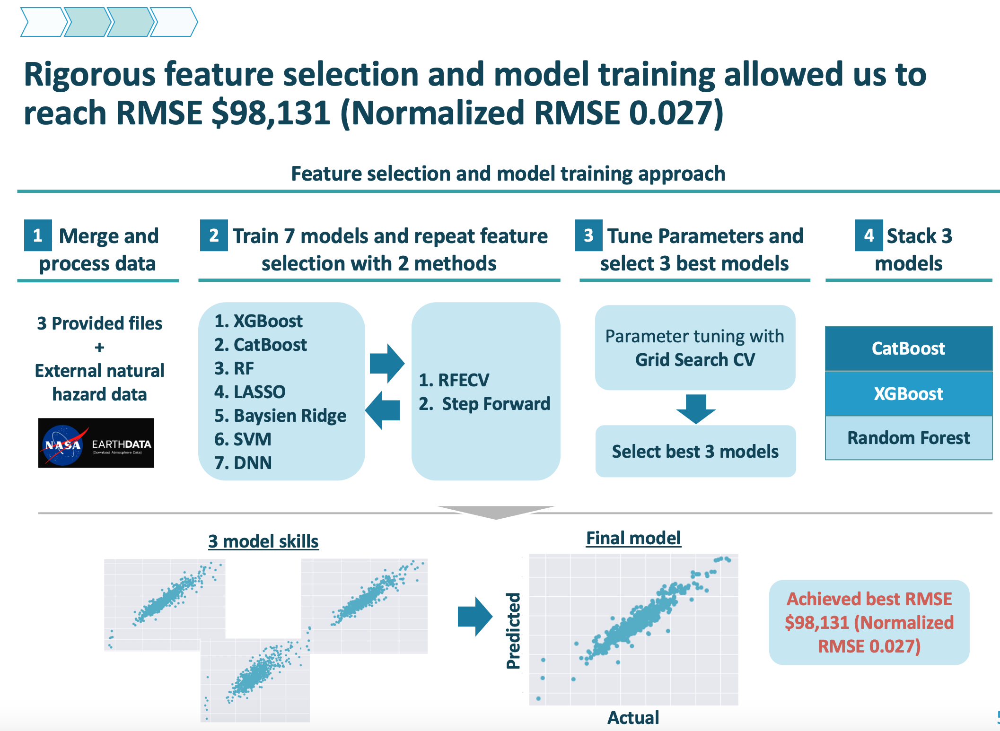
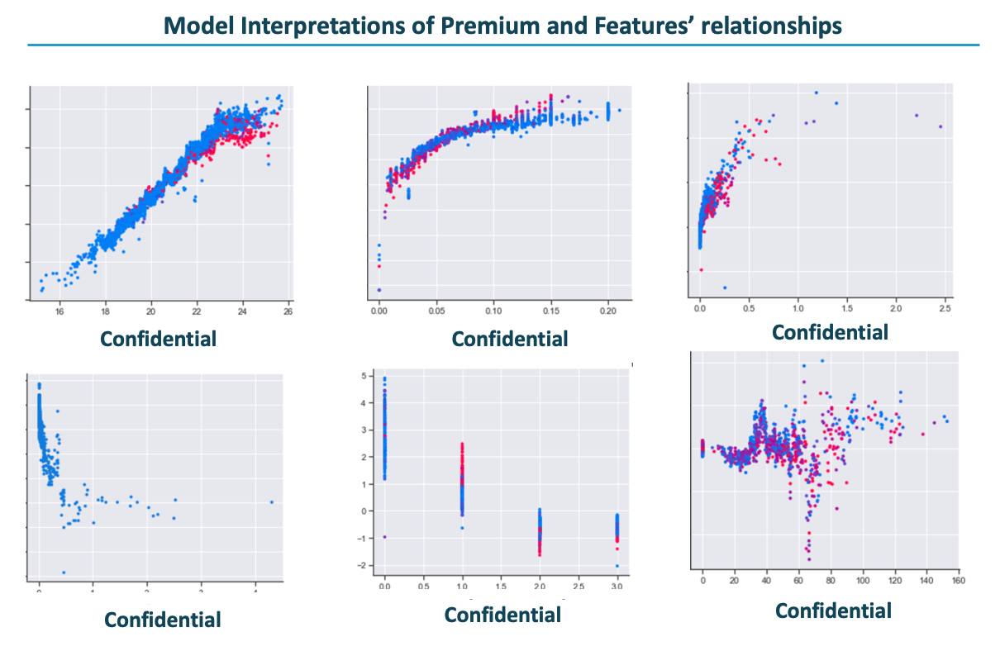

# Prediction of market premium

<!-- markdown-toc start - Don't edit this section. Run M-x markdown-toc-refresh-toc -->

## Project context and objectives
In recent years, the gap between the amount of initially agreed premium (market premium) and actual premium has been increasing for property damage and business interruption insurance policies, due to the increase of unpredictable catastorophic events. This means that reinsurance companies are at the risk of paying the cost.  
Thus, as a reninsurance comany, they want to minimize the gap as much as possible to reduce the losses, by leveraging the data science. 
 
The difficulty was lying on:
- Large variation in categorical variables (country and industry), which increases the variance and could not be simply one-hot-encoded 
- Extreme values which could not be treated as outliers and high variance in target data with relatively small number of observations
- One premium value contanis several detailed regions or business unites, which have to be captured somehow.
*Since the data is confidencial, this repository represents only part of the work. 

## Solution highlishts
- Feeded NASA natural disaster data (earthquake)
- To reduce variance, rigorously selected only the features that has significant marginal effect
- Applied label encoding and hashing for encoding
- To reduce overfitting, stacked combined Boostong and Bagging

   

   

   

   

## Result
Our final model was one of the top among the others and could predict the market premium with root mean square error of $98,131, which is significantly a good performance given the range of premium values.

## Further work
- Although our model score was one of the top, there was problem in hasing of categorical variables - it was specific to training data - thus, the hashing method have to be generalized.
- Retain the detailed information by weighting the market premium by subdivisional characteristics, instead of applying simple average.
- Earthquake shap value has non linearity, it can be assumed from the data analysis that impact of earthquake is depending on the industry and country of the client, 
for example Japan is faced with numerous earthquake risks but at the same time the infrustructure is one of the strongest in the world so would not cause property damage.
