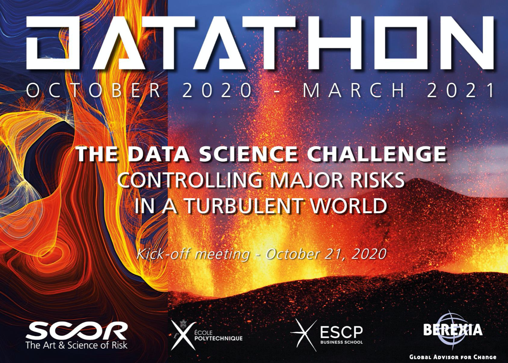
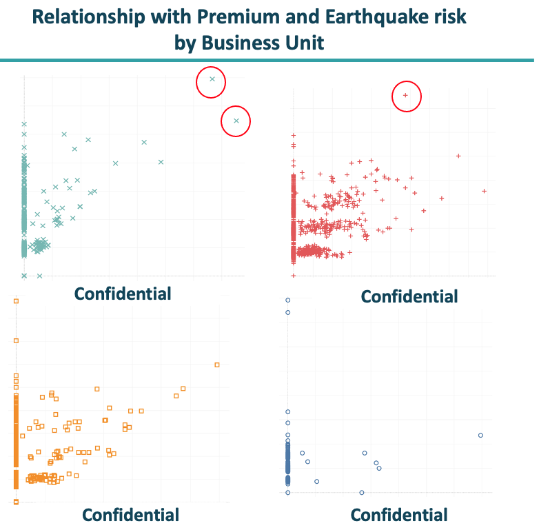

# SCOR Datathon 2021

<!-- markdown-toc start - Don't edit this section. Run M-x markdown-toc-refresh-toc -->

## About competition
Data science master students from grandes écoles including X and ESCP had worked 4 months building a model to predict premium of propaty damage and business interuption.  
In recent years, the gap between market agreed premium and the reference premium has been increasing, due to the unpredictability of catastorophic events. Thus, our goal was to shring the gap as much as possible. 
 
The difficulty was lying on:
- Large variation in categorical variables (country and industry), which increases the variance and could not be simply one-hot-encoded 
- Extreme values which could not be treated as outliers and high variance in target data with relatively small number of observations
- One target value has several rows for its breakdown of detail
*Since the data is confidencial, this reposidoty represents only part of our work. 

## Our solution highlishts
- Feeded NASA natural disaster data (earthquake)
- To reduce variance, rigorously selected only the features that has significant marginal effect
- Applied label encoding and hashing for encoding
- To reduce overfitting, stacked combined Boostong and Bagging

 

 

## Further work
- Although our model score was one of the top, there was problem in hasing of categorical variables - it was very specific to training data - thus, fix the hashing problem
- Retain detail information by weight the value insured value etc.
- Earthquake shap value has non linearity, it can be assumed from the data analysis that impact of earthquake is depending on the industry and country of the client, 
for example Japan is faced with numerous earthquake risks but at the same time the infrustructure is one of the strongest in the world so would not cause property damage.
